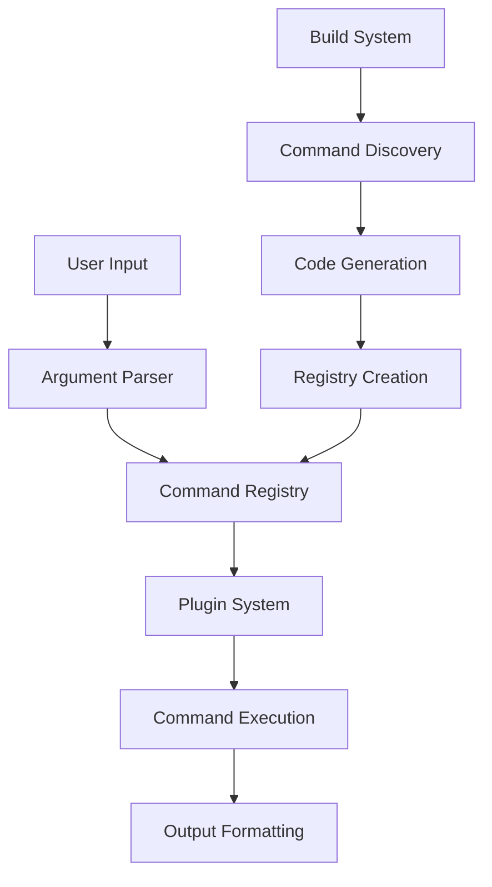

# Ticket 12: Enhance Documentation and Developer Experience

## Priority
🟢 **Low**

## Component
Documentation, examples, developer tools

## Description
While the current documentation is comprehensive, there are opportunities to improve developer onboarding, add more examples, create interactive tutorials, and enhance the overall developer experience for both zcli users and contributors.

## Current Documentation State
- ✅ Excellent DESIGN.md with architectural details
- ✅ Good README.md with basic usage
- ✅ Specialized guides (BUILD.md, ERROR_HANDLING.md)
- ⚠️ Limited step-by-step tutorials
- ⚠️ No interactive examples or playground
- ⚠️ Missing API reference documentation
- ⚠️ No video tutorials or visual guides

## Proposed Enhancements

### 1. Interactive Tutorial System
```markdown
# Interactive Tutorial: Building Your First CLI

## Step 1: Project Setup
Run the following command to create a new zcli project:

```bash
mkdir my-cli && cd my-cli
# Tutorial framework validates each step
```

✅ **Check**: Directory created successfully

## Step 2: Basic Command Structure
Create your first command file:

```bash
mkdir -p src/commands
cat > src/commands/hello.zig << 'EOF'
const zcli = @import("zcli");

pub const Args = struct {
    name: []const u8 = "World",
};

pub const Options = struct {};

pub fn execute(args: Args, options: Options, context: *zcli.Context) !void {
    try context.stdout().print("Hello, {s}!\n", .{args.name});
}
EOF
```

✅ **Check**: Command file created with correct structure

## Step 3: Build Configuration
```

### 2. Comprehensive API Reference
```zig
/// Generate API documentation from source code
pub const DocGenerator = struct {
    pub fn generateApiDocs(comptime modules: []const type) ![]const u8 {
        var docs = std.ArrayList(u8).init(allocator);
        
        inline for (modules) |Module| {
            try docs.writer().print("## {s}\n\n", .{@typeName(Module)});
            
            const type_info = @typeInfo(Module);
            if (type_info == .Struct) {
                // Document public functions
                inline for (type_info.Struct.decls) |decl| {
                    if (decl.is_pub) {
                        try documentDeclaration(docs.writer(), Module, decl.name);
                    }
                }
            }
        }
        
        return docs.toOwnedSlice();
    }
    
    fn documentDeclaration(writer: anytype, comptime Module: type, comptime name: []const u8) !void {
        if (@hasDecl(Module, name)) {
            const field = @field(Module, name);
            const field_type = @TypeOf(field);
            
            if (@typeInfo(field_type) == .Fn) {
                try documentFunction(writer, name, field_type);
            }
        }
    }
};
```

### 3. Example Gallery
```markdown
# zcli Examples Gallery

## Basic Examples

### Simple Calculator CLI
[📁 examples/calculator/](examples/calculator/)
- Basic arithmetic operations
- Input validation
- Error handling

### File Processing Tool
[📁 examples/file-processor/](examples/file-processor/)
- File I/O operations
- Batch processing
- Progress indicators

## Advanced Examples

### Git Clone (Complex CLI)
[📁 examples/git-clone/](examples/git-clone/)
- Hierarchical commands (`git remote add`, `git remote remove`)
- Plugin system usage
- Configuration management

### Cloud CLI (Enterprise-style)
[📁 examples/cloud-cli/](examples/cloud-cli/)
- Authentication and sessions
- Resource management
- Output formatting (JSON, table, YAML)
```

### 4. Visual Architecture Diagrams


### 5. Developer Onboarding Guide
```markdown
# zcli Developer Onboarding

## 🎯 Quick Start (5 minutes)
1. **Clone and build**: `git clone ... && zig build`
2. **Run example**: `cd examples/basic && zig build && ./zig-out/bin/gitt --help`
3. **Create your first command**: Follow the interactive tutorial

## 📚 Learning Path (30 minutes)
- [ ] Complete interactive tutorial
- [ ] Read DESIGN.md overview
- [ ] Explore example applications
- [ ] Try modifying an example command

## 🛠️ Contributing (1 hour)
- [ ] Set up development environment
- [ ] Run test suite
- [ ] Review contribution guidelines
- [ ] Create your first pull request

## 🚀 Advanced Topics (2+ hours)
- [ ] Plugin development
- [ ] Build system customization
- [ ] Performance optimization
- [ ] Security considerations
```

### 6. Best Practices Guide
```zig
// examples/best-practices/command-design.zig

/// ✅ Good: Clear, focused command with specific purpose
const GoodCommand = struct {
    pub const Args = struct {
        /// File to process (required)
        file: []const u8,
        /// Output format (optional, with sensible default)
        format: enum { json, yaml, toml } = .json,
    };
    
    pub const Options = struct {
        /// Enable verbose output
        verbose: bool = false,
        /// Override default output directory
        output_dir: ?[]const u8 = null,
    };
    
    pub fn execute(args: Args, options: Options, context: *zcli.Context) !void {
        // Implementation with proper error handling
        const file = std.fs.cwd().openFile(args.file, .{}) catch |err| {
            return context.stderr().print("Error opening file '{}': {}\n", .{args.file, err});
        };
        defer file.close();
        
        // ... rest of implementation
    }
};

/// ❌ Bad: Unclear purpose, too many responsibilities
const BadCommand = struct {
    pub const Args = struct {
        stuff: []const u8,  // Vague name
        things: ?[]const u8,  // Unclear when this is needed
    };
    
    pub const Options = struct {
        flag1: bool = false,  // No description
        flag2: bool = false,
        flag3: bool = false,  // Too many boolean flags
    };
    
    pub fn execute(args: Args, options: Options, context: *zcli.Context) !void {
        // Does too many different things
    }
};
```

### 7. Performance Profiling Tools
```zig
pub const ProfilingTools = struct {
    pub fn profileCommandExecution(comptime Command: type, args: []const []const u8) !PerformanceReport {
        var timer = try std.time.Timer.start();
        const start_memory = getCurrentMemoryUsage();
        
        // Execute command with profiling
        const result = Command.execute(args);
        
        const end_time = timer.read();
        const end_memory = getCurrentMemoryUsage();
        
        return PerformanceReport{
            .execution_time_ns = end_time,
            .memory_used_bytes = end_memory - start_memory,
            .command_name = @typeName(Command),
        };
    }
    
    pub fn generatePerformanceReport(reports: []const PerformanceReport) ![]const u8 {
        // Generate HTML report with charts and analysis
    }
};
```

### 8. Migration Guides
```markdown
# Migration Guide: Upgrading to zcli v2.0

## Breaking Changes

### 1. Command Interface Changes
**Before (v1.x):**
```zig
pub fn execute(ctx: *Context, args: [][]const u8) !void
```

**After (v2.0):**
```zig
pub fn execute(args: Args, options: Options, context: *Context) !void
```

**Migration Steps:**
1. Create `Args` and `Options` structs
2. Update function signature
3. Use structured arguments instead of raw strings

### 2. Error Handling
**Before:** Simple error returns
**After:** Structured errors with context

**Migration Script:**
```bash
#!/bin/bash
# Automated migration helper
find . -name "*.zig" -exec sed -i 's/error.InvalidArgument/StructuredError{.invalid_argument = .{}}/g' {} \;
```
```

### 9. Community Resources
```markdown
# zcli Community

## 💬 Getting Help
- **Discord**: [zcli Community Server](https://discord.gg/zcli)
- **Forum**: [GitHub Discussions](https://github.com/zcli/zcli/discussions)
- **Stack Overflow**: Tag your questions with `zcli`

## 📝 Blog Posts and Articles
- [Building Modern CLIs with zcli](https://blog.example.com/zcli-intro)
- [Performance Optimization in zcli](https://blog.example.com/zcli-perf)
- [Plugin Development Guide](https://blog.example.com/zcli-plugins)

## 🎥 Video Tutorials
- [zcli in 10 Minutes](https://youtube.com/watch?v=example)
- [Advanced zcli Techniques](https://youtube.com/watch?v=example)
- [Building Production CLIs](https://youtube.com/watch?v=example)

## 🏆 Showcase
Applications built with zcli:
- **DevOps CLI**: Infrastructure management tool
- **Data Processing CLI**: ETL pipeline tool
- **API Testing CLI**: REST API testing framework
```

### 10. Interactive Examples Platform
```markdown
# zcli Playground

## Try zcli in Your Browser

The zcli playground lets you experiment with zcli commands without installing anything:

1. **Choose a template**: Basic CLI, File Processor, Git-like Tool
2. **Edit the code**: Modify commands, options, and logic
3. **Test instantly**: Run commands and see output
4. **Share examples**: Generate shareable links

[🚀 Open Playground](https://playground.zcli.dev)

## Embedded Examples

Each documentation page includes runnable examples:

```zcli-example
// This code block is executable in the browser
const zcli = @import("zcli");

pub const Args = struct {
    name: []const u8,
};

pub fn execute(args: Args, options: struct{}, ctx: *zcli.Context) !void {
    try ctx.stdout().print("Hello, {}!\n", .{args.name});
}
```

[▶️ Run this example](javascript:runExample('hello-world'))
```

## Implementation Plan

### Phase 1: Core Documentation (1 week)
- [ ] Create interactive tutorial system
- [ ] Generate comprehensive API reference
- [ ] Expand example gallery with 5+ new examples

### Phase 2: Visual and Interactive Content (1 week)
- [ ] Create architecture diagrams
- [ ] Build interactive playground prototype
- [ ] Record video tutorials for basic usage

### Phase 3: Community Resources (1 week)
- [ ] Set up community forums/Discord
- [ ] Create showcase of applications built with zcli
- [ ] Write best practices guide

### Phase 4: Developer Tools (1 week)
- [ ] Build performance profiling tools
- [ ] Create migration guides and scripts
- [ ] Add development environment setup automation

## Documentation Automation

### Auto-generating Documentation
```zig
// build.zig integration
const docs = b.addSystemCommand(&.{
    "zig", "run", "tools/doc-generator.zig", "--", 
    "src/", "docs/api/"
});
docs.step.dependOn(&lib.step);

// Generate docs after build
const docs_step = b.step("docs", "Generate documentation");
docs_step.dependOn(&docs.step);
```

### Documentation Testing
```zig
test "documentation examples compile and run" {
    const examples_dir = "docs/examples/";
    var dir = try std.fs.cwd().openDir(examples_dir, .{ .iterate = true });
    defer dir.close();
    
    var iterator = dir.iterate();
    while (try iterator.next()) |entry| {
        if (std.mem.endsWith(u8, entry.name, ".zig")) {
            // Compile and test each documentation example
            const result = try std.process.Child.run(.{
                .allocator = std.testing.allocator,
                .argv = &.{ "zig", "test", entry.name },
                .cwd_dir = dir,
            });
            defer {
                std.testing.allocator.free(result.stdout);
                std.testing.allocator.free(result.stderr);
            }
            
            try std.testing.expectEqual(@as(u8, 0), result.term.Exited);
        }
    }
}
```

## Metrics and Feedback

### Documentation Analytics
```javascript
// Track documentation usage
const analytics = {
    trackPageView: (page) => {
        // Track which docs are most viewed
    },
    trackExampleRun: (example) => {
        // Track which examples users try most
    },
    trackSearchQuery: (query) => {
        // Improve search and content based on queries
    }
};
```

### User Feedback System
```markdown
## Help us improve the docs!

At the bottom of each page:

**Was this page helpful?** 👍 👎

**What would you like to see improved?**
- [ ] More examples
- [ ] Clearer explanations  
- [ ] Video tutorials
- [ ] Interactive demos

[💬 Suggest an improvement](https://github.com/zcli/zcli/issues/new?template=docs-improvement.md)
```

## Success Metrics
- **Documentation Coverage**: >90% of public APIs documented
- **User Onboarding**: <10 minutes from clone to first successful CLI
- **Example Quality**: All examples build and run successfully
- **Community Engagement**: Active community forum with regular posts
- **Developer Satisfaction**: >4.5/5 in developer experience surveys

## Acceptance Criteria
- [ ] Interactive tutorial covers all major features
- [ ] API reference includes all public functions with examples
- [ ] 10+ comprehensive examples in different domains
- [ ] Visual architecture diagrams for all major concepts
- [ ] Performance profiling tools for command optimization
- [ ] Migration guides for version upgrades
- [ ] Community resources (forum, showcase, blog posts)
- [ ] Documentation builds and tests pass in CI
- [ ] User feedback system operational

## Estimated Effort
**4 weeks** (1 week per phase, can be done in parallel with development work)